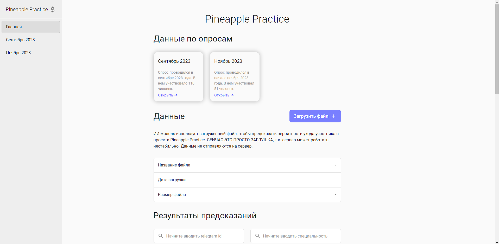
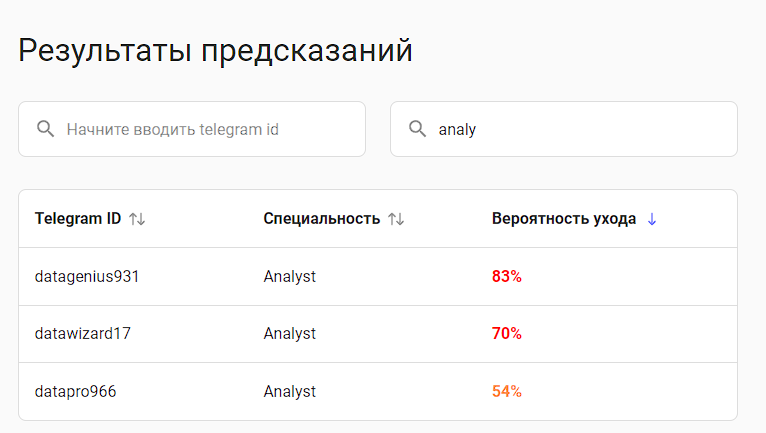
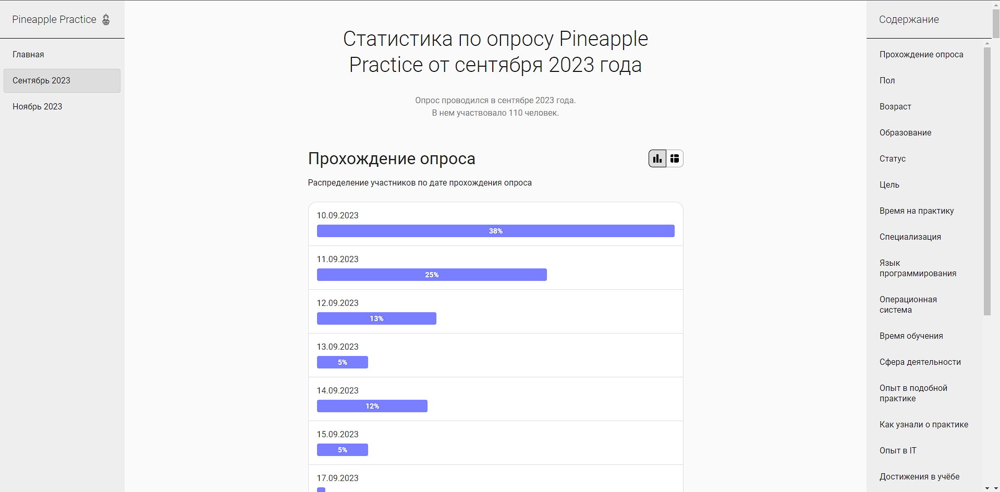
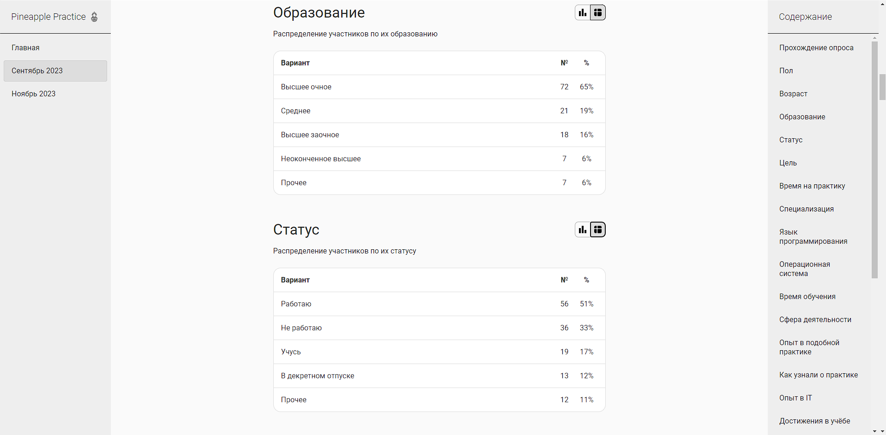
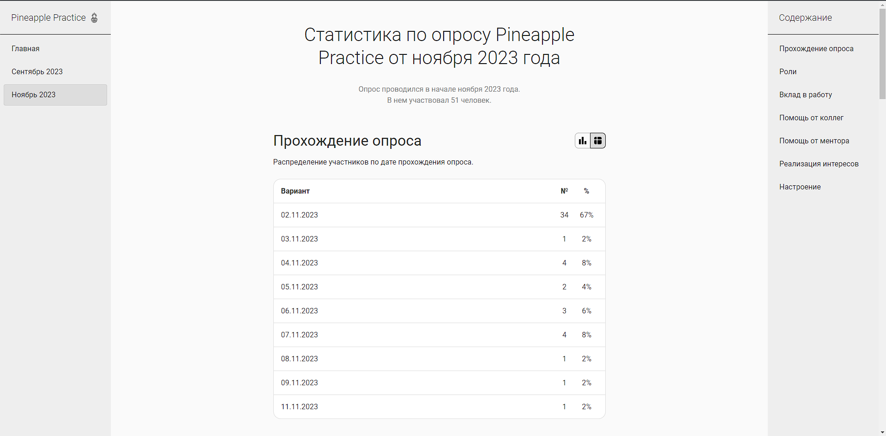

<h1 align="center">Participants Stats</h1>
<p align="center">
  Made with <code>HTML</code>, <code>SCSS</code>, <code>TypeScript</code>, <code>ReactJS</code>, <code>CSS Modules</code>
  <br>
  Bootstrapped with <code>Vite</code>
</p>

<p align="center">
  <a href="../../actions"></a>
  <a href="../../commits"></a>
  <a href="./LICENSE"></a>
  
  
</p>

<p align="center">
  <a href="#-screenshots">🖼 Screenshots</a> • 
  <a href="#ℹ%EF%B8%8F-about">ℹ️ About</a> • 
  <a href="#%EF%B8%8F-tools">⚙️ Tools</a> • 
  <a href="#-build-project">🔨 How to Build Project</a> • 
  <a href="#-file-structure">📁 File Structure</a>
</p>

<sup>
  <p align="center">
    <a href="#-npm-packages-worth-mentioning">📦 NPM Packages worth mentioning</a> • 
    <a href="#-details">💡 Details</a> • 
    <a href="#-useful-resources">🔗 Useful resources</a> • 
    <a href="#-author">👤 Author</a>
  </p>
</sup>

## 🖼 Screenshots

<p align="center">
  
</p>

<p align="center">
  
</p>

<p align="center">
  
</p>

<p align="center">
  
</p>

<p align="center">
  
</p>

## ℹ️ About

I participated in a Pinapple Practice project, вот такие пироги. You can read more about it on their official website: https://pnpl.site/ or on their LinkedIn page: https://www.linkedin.com/company/pineapple-practice/. Keep in mind, everything is written in Russian.

The project idea is to show stats derived from polls. Polls were stored in Google Sheets. I exported the polls in .csv format, then turned them into JavaScript arrays, removed personal information and saved in the project.

The project had a frontend part and a backend part. Here I publish a cut version of the frontend app that doesn't include personal information and interaction with backend. Reason: I dunno what's gonna happen with the backend, it might stop working at any moment.

## ⚙️ Tools

- **HTML5**
- **CSS**
  - CSS Modules
  - SASS/SCSS
- **TypeScript**
  - ReactJS
- **Github Pages**

## 🔨 Build project

<table>
  <tr>
    <th>Command</th>
    <th>Description</th>
  </tr>
  <tr>
    <td><code>npm&nbsp;i</code></td>
    <td>First things first, install all required packages</td>
  </tr>
  <tr>
    <td><code>npm&nbsp;run&nbsp;dev</code></td>
    <td>Run the app in development mode</td>
  </tr>
  <tr>
    <td><code>npm&nbsp;run&nbsp;build</code></td>
    <td>Build the app</td>
  </tr>
  <tr>
    <td><code>npm&nbsp;run&nbsp;preview</code></td>
    <td>Run the app in production mode</td>
  </tr>
  <tr>
    <td><code>npm&nbsp;run&nbsp;lint</code></td>
    <td>Check compliance with Eslint rules</td>
  </tr>
  <tr>
    <td><code>npm&nbsp;run&nbsp;prettier-check</code></td>
    <td>Check compliance with Prettier rules</td>
  </tr>
  <tr>
    <td><code>npm&nbsp;run&nbsp;prettier-fix</code></td>
    <td>Fix code formatting in source files so they comply with Prettier</td>
  </tr>
</table>

## 📁 File Structure

```Markdown
├── 📁 .github
|   └── 📁 workflows
|       └── 📝 main.yaml      CI/CD instructions for Github Actions
|
├── 📁 docs                   Additional information, documentation
│   └── 📁 results            Screenshots of how the application works after being fully developed
|
├── 📁 src                    Source files needed for application development
│   ├── 📁 assets             Static assets: images, icons, favicons
|   |
│   ├── 📁 components         React components
|   |   └── 📁 ComponentName
|   |       ├── 📝 index.tsx           Component logic
|   |       ├── 📝 index.module.scss   (optional) Component styles
|   |       ├── 📝 index.types.tsx     (optional) Component types
|   |       ├── 📝 hooks.tsx           (optional) Custom hooks used only in this component
|   |       ├── 📝 utils.ts            (optional) Custom utility functions used only in this component
|   |       └── 📝 other files         Other additional files
|   |
│   ├── 📁 data               Code responsible for providing data for the graphs
|   |
│   ├── 📁 hooks              Custom React hooks
|   |
│   ├── 📁 pages              React components for pages
|   |   └── 📁 PageName
|   |       ├── 📝 index.tsx           Page logic
|   |       ├── 📝 index.module.scss   Page styles
|   |       ├── 📝 index.types.tsx     (optional) Page types
|   |       └── 📝 _other files_       Other additional files
|   |
│   ├── 📁 shared             Shared types
|   |
│   ├── 📁 utils              Utility functions
|   |
│   ├── 📝 globals.scss       Global styles
│   ├── 📝 index.html         Root HTML file
│   ├── 📝 index.tsx          Entry point for the module bundler
│   └── 📝 vite-end.d.ts      Some Typescript stuff for Vite
|
├── 📝 .eslintrc.cjs          ESLint configuration file
├── 📝 .gitignore             Instructions for Git about what files to ignore
├── 📝 .prettierrc.json       Prettier configuration file
├── 📝 LICENSE                MIT License. Basically you can do whatever you want with the code
├── 📝 package-lock.json      Keeps track of the exact version of every package that is installed
├── 📝 package.json           Various metadata relevant to the project, scripts, dependencies
├── 📝 README.md              Project description
├── 📝 tsconfig.json          TypeScript configuration file
├── 📝 tsconfig.node.json     TypeScript configuration file for Vite
└── 📝 vite.config.js         Vite configuration file
```

## 📦 NPM Packages worth mentioning

<table>
  <tr>
    <td><code>clsx</code></td>
    <td>For conditional lists of CSS classes</td>
  </tr>
  <tr>
    <td><code>sass</code></td>
    <td>Mainly for using nesting, mixins, static variables in CSS</td>
  </tr>
</table>

## 💡 Details

At first, tried to use MaterialUI, but quickly got sick of it. The project appeared to be quite simple, it had custom design made by me... so it was logical to make everything custom.

Also used a library that generates charts, it worked just fine, but the charts looked very, very bad, so I remade them from scratch.

## 🔗 Useful resources

n/a

## 👤 Author

- Frontend Mentor - [@GrbnvAlex](https://www.frontendmentor.io/profile/GrbnvAlex)
- Telegram - [@Arlagonix](https://t.me/Arlagonix)
- Github - [@arlagonix](https://github.com/arlagonix)
